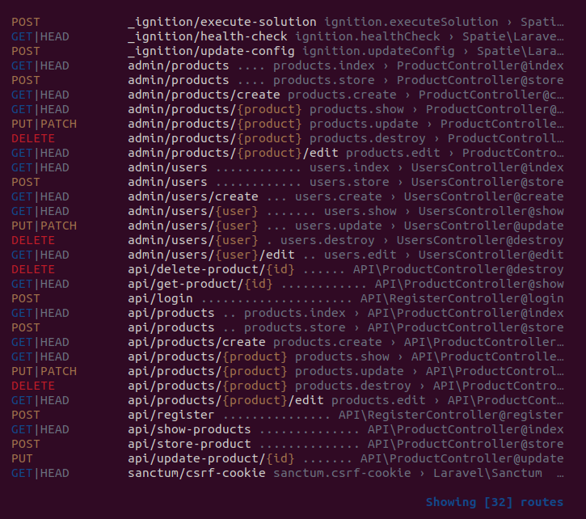
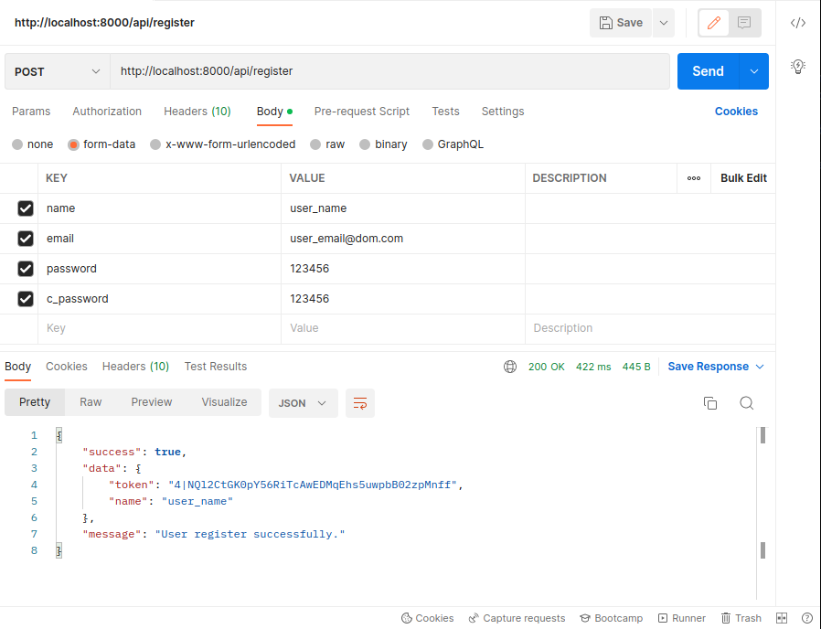
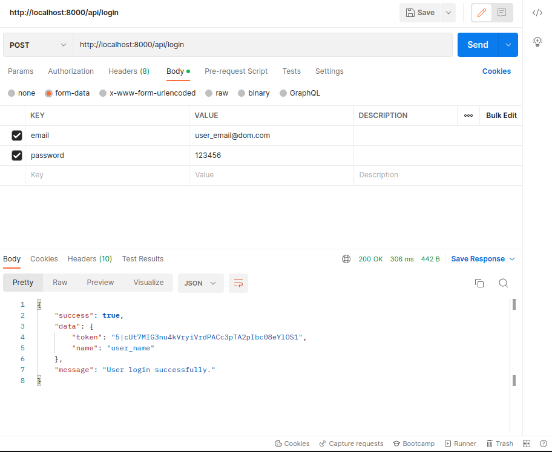
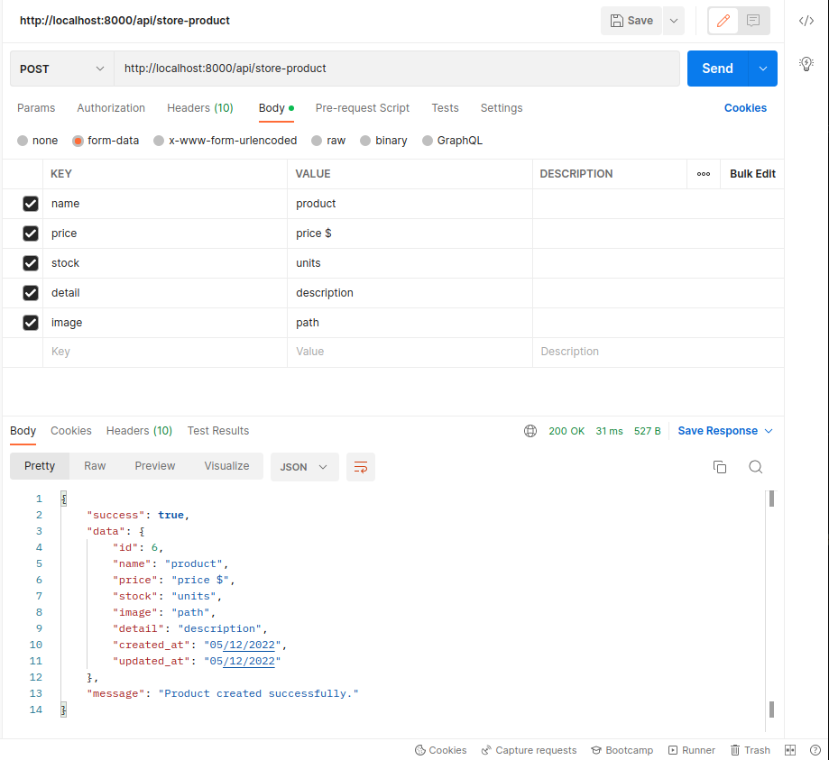
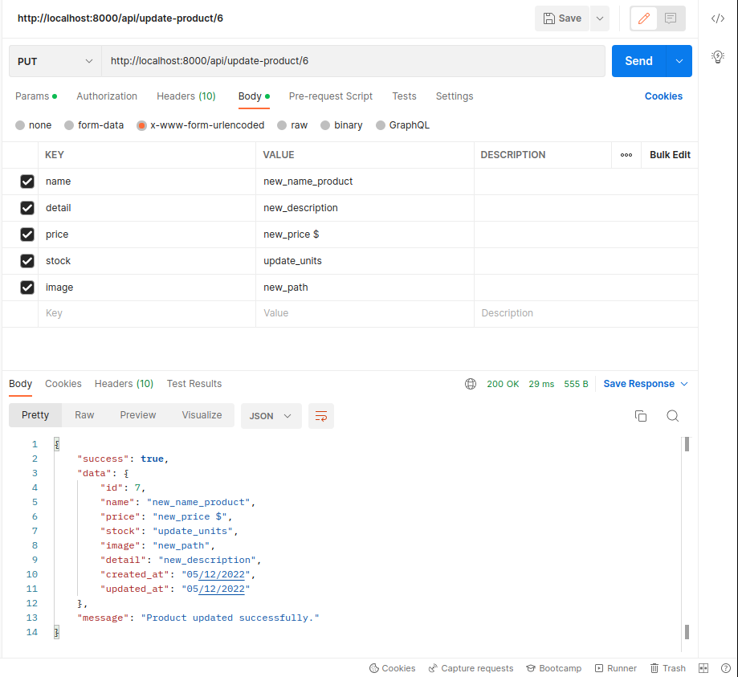
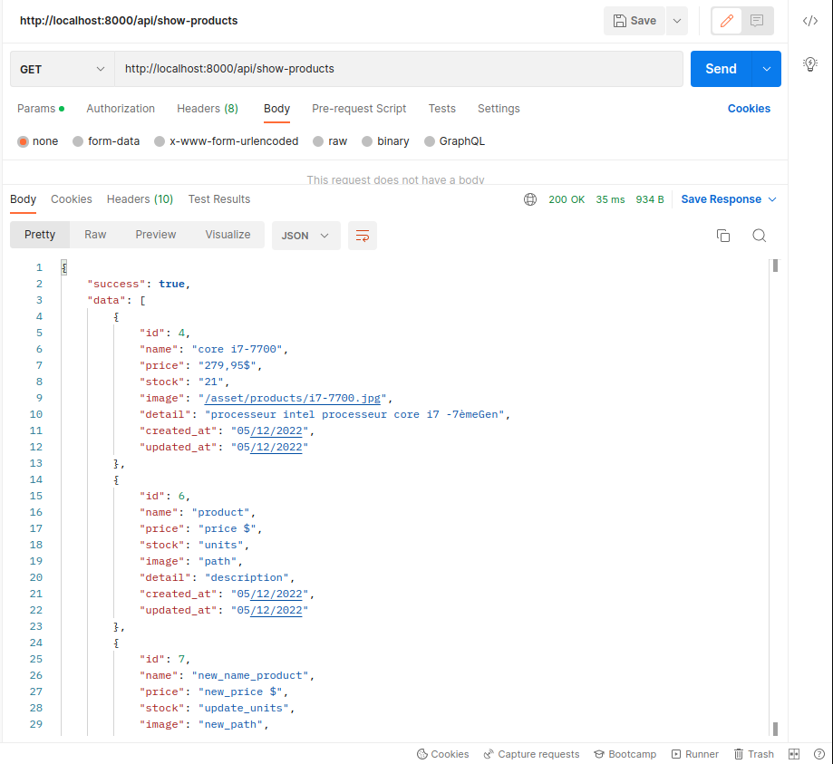
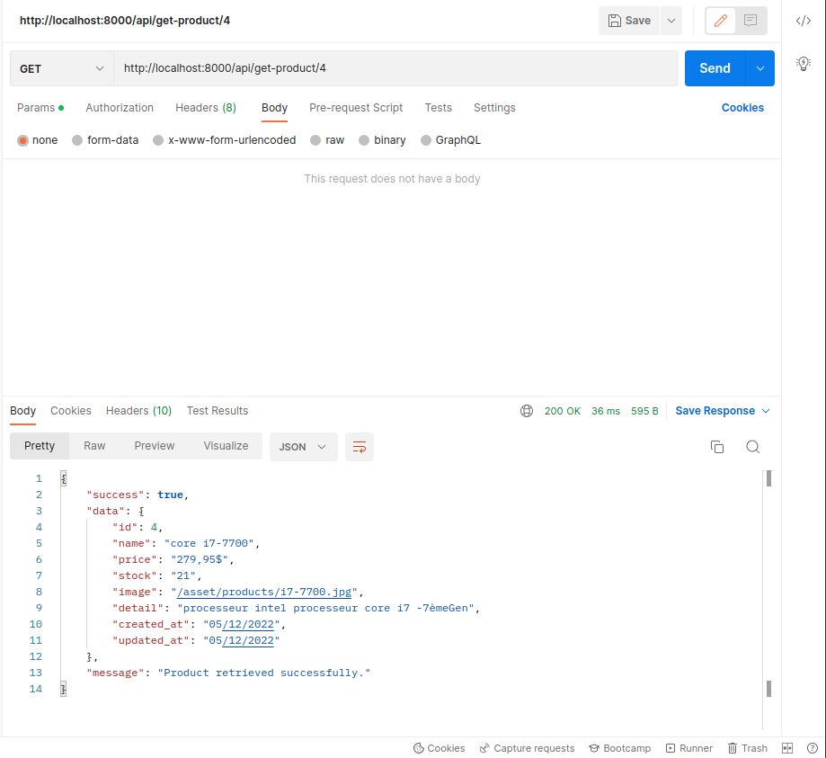
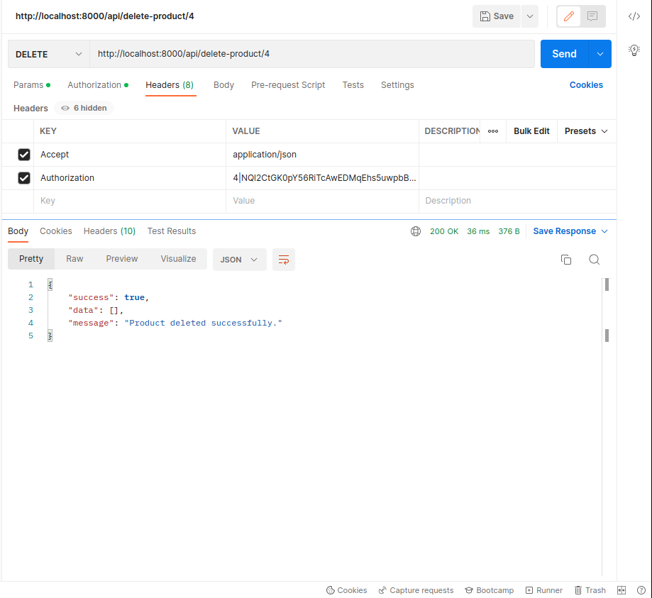
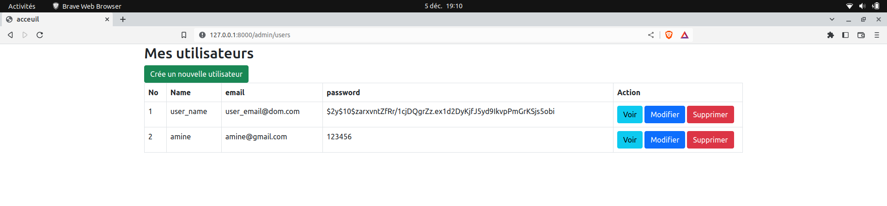
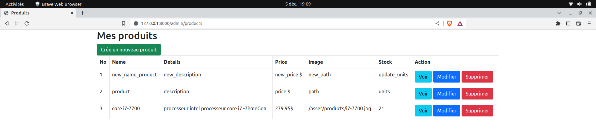

## E-COMMERCE PROJECT  (DIGITAL/ITECH)

## Installation 

1. git clone repository_link "name (as you want for your folder, not required)" 
1. example: git clone https://github.com/Douba9/E-Commerce folder_name

2. cd  folder_name
2. example: cd E-commerce: _ cd server && npm i && composer i && touch .env

3. copy .env file and update your DATABASE section (database_name, user_login, password_login) . 
3. example : nano .env 
                            : and write this values in .env file : 
                                                    DB_CONNECTION = mysql
                                                    DB_HOST       =  127.0.0.1
                                                    DB_PORT       =  3306
                                                    DB_DATABASE   =  "write your database name here"
                                                    DB_USERNAME   =  "write your database user_name here"
                                                    DB_PASSWORD   =  "write your database user_password here"

        you can also copy all content from .env.example and repalce values or rename file in .env and change values with your.

4. run : php artisan migrate (to create all necesary tables on your database after write your ID database)
5. run : php artisan serve (to run and start your API)

## Nous utilisons Laravel 9.x pour configurer notre API

Headers {
   Accept : application/json
   Authorization : 'Bearer '.$accessToken
}

<!-- route -->

1. /api/register => Inscription  : Opérationnel

    

2. /api/login => Connection  : Opérationnel

    

3. /api/store-product => Ajouter un produit  : Opérationnel

    

4. /api/update/{id} => Mettre à jour le produit  : Opérationnel

    

5. /api/show-products => Affichez la liste de tout les produits  : Opérationnel

    

6. /api/get-product/{id} => Affiche un produit selectionner  : Opérationnel

    

7. /api/delete-product/{id} => Supprime le prosuit séléctionner  : Opérationnel

    

## CRUD from back-end
1. /admin/users => all users  : Opérationnel

    

2. /admin/products => all products  : Opérationnel

    
